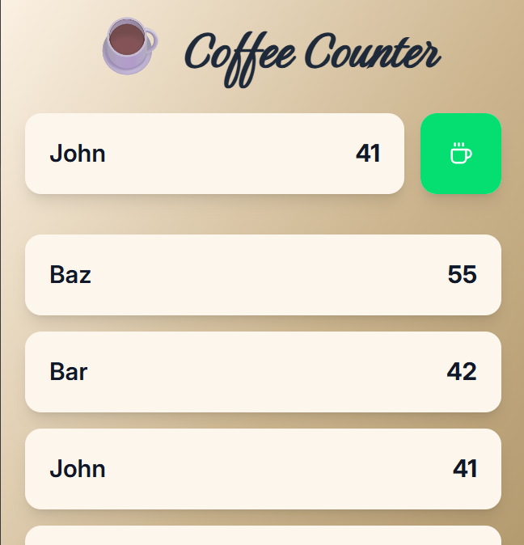

# ☕ coffee-counter
> A simple webapp to count the coffee consumption among colleagues

Check out the backend and frontend `README` files for installation instructions.
Start the backend service before the frontend service.

## backend
Written in Python. Using fastapi to handle requests to the webapp. Data is stored in a dedicated excel spreadsheet in a local (or shared network) drive.

## frontend
Written in javascript. Using react, vite and tailwind.